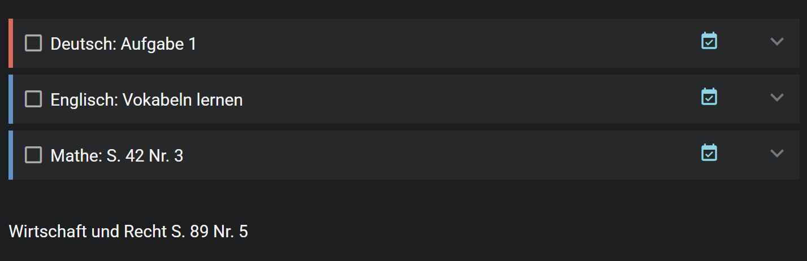
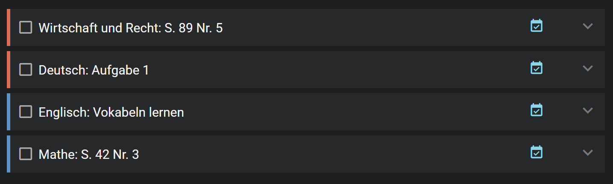

# Amplenote Homework Scheduler

An Amplenote plugin that turns plain-text homework lines into scheduled tasks in the same note.

The plugin detects the subject at the start of each homework line, looks up the next matching lesson from a Google Calendar ICS feed via a Cloudflare Worker, and schedules the homework for 17:00 on the day before that lesson. If the calendar cannot be reached, or if no matching lesson is found for a subject, it falls back to the hardcoded timetable inside the plugin.

## What It Does

Run the plugin from a homework note. It scans each non-task line, detects the subject at the start, creates an Amplenote task, and removes the original plain-text line after the task is created successfully.

For each detected homework item, the plugin:

- Fetches the school calendar through the configured Cloudflare Worker.
- Finds the next lesson whose calendar summary or description matches the detected subject.
- Skips cancelled lessons and lessons replaced by overlapping WebUntis update events.
- Schedules the task for 17:00 on the day before that lesson.
- Falls back to the hardcoded timetable when calendar lookup fails or misses that subject.
- Shows a summary that says whether each task used `calendar` or `timetable`.

Existing unchecked scheduled tasks in the note are sorted by their `startAt` timestamp after each run.

## Example

**Input in a note:**



**Resulting tasks:**



## Supported Input

Each homework line should start with a subject name or alias, followed by the homework text.

Supported separators:

- `Mathe S. 42`
- `Mathe: S. 42`
- `Mathe - S. 42`

Existing task lines such as `- [ ] ...` and checked tasks are skipped.

## Calendar Setup

The plugin does not fetch Google Calendar directly from Amplenote. Google's ICS feed is blocked by browser CORS, so the plugin uses a small Cloudflare Worker as a secure proxy.

The Worker should:

- Store the private Google Calendar ICS URL as a Cloudflare secret named `ICS_URL`.
- Store a random bearer token as a Cloudflare secret named `ACCESS_TOKEN`.
- Require `Authorization: Bearer <token>`.
- Return the ICS calendar with browser CORS headers.

Use `cloudflare_worker_calendar_proxy.js` as the Worker implementation.

## Plugin Settings

Configure these settings in Amplenote:

- `Calendar Proxy URL`: your deployed Cloudflare Worker URL, for example `https://calendar-proxy.example.workers.dev/`
- `Calendar Proxy Access Token`: the same random token stored in the Worker's `ACCESS_TOKEN` secret

The plugin only stores the Worker URL and access token. The private Google Calendar ICS URL stays in Cloudflare.

## Installation

1. Create a new note in Amplenote.
2. Open the note's markdown editor.
3. Paste the full contents of `homework_plugin.md`.
4. Enable that note as a plugin from Amplenote's plugin settings.
5. Fill in the plugin settings:
   - `Calendar Proxy URL`
   - `Calendar Proxy Access Token`

Official docs: https://www.amplenote.com/help/developing_amplenote_plugins/plugin_creation

## Usage

1. Open the note containing homework lines.
2. Run /amplenote-homework-scheduler or the plugin note option from Amplenote.
3. Review the summary alert.

The plugin uses the note where it was invoked. It does not require a hardcoded homework note UUID.

## Testing The Worker

Use the helper script to check the Worker outside Amplenote:

```powershell
powershell -ExecutionPolicy Bypass -File .\test_worker_fetch.ps1 "https://your-worker-url" "your-token"
```

The script checks the browser-style CORS preflight and then fetches the calendar with the bearer token. A healthy result should show:

- `Status: 204` for the preflight
- `Access-Control-Allow-Headers` including `Authorization`
- `Status: 200` for the calendar fetch
- `Looks like ICS: yes`

## Configuration In Code

Most configuration still lives near the top of `homework_plugin.md`:

- `timetable`: fallback lesson days per subject, using `1=Mon` through `7=Sun`
- `subjectAliases`: accepted names and abbreviations for each subject
- `subjectDurations`: estimated task duration in minutes
- `LOOKAHEAD_DAYS`: how far ahead to scan the calendar, currently `35`

The fallback timetable is still useful when the calendar is temporarily unavailable or when a subject has no matching calendar event.

## Current Limitations

- Calendar matching uses fuzzy summary/description matching, so unusual calendar event text may need extra aliases.
- Recurring calendar support covers normal weekly `RRULE` events, basic `EXDATE` exclusions, and simple `RECURRENCE-ID` overrides/cancellations.
- WebUntis `[X]` cancellation events and overlapping `[+]` replacement/update events are used to avoid scheduling homework for lessons you do not actually attend.
- The plugin currently supports one calendar proxy URL.
- Task time is fixed at 17:00 on the day before the lesson.

## Files

- `amplenote-homework-scheduler.md`: the Amplenote plugin note content.
- `cloudflare_worker_calendar_proxy.js`: Cloudflare Worker used to fetch the private Google Calendar ICS feed securely.
- `test_worker_fetch.ps1`: local helper for testing the Worker endpoint and CORS behavior.
- `test_ics_fetch.ps1`: older helper for testing raw Google ICS fetch behavior.
